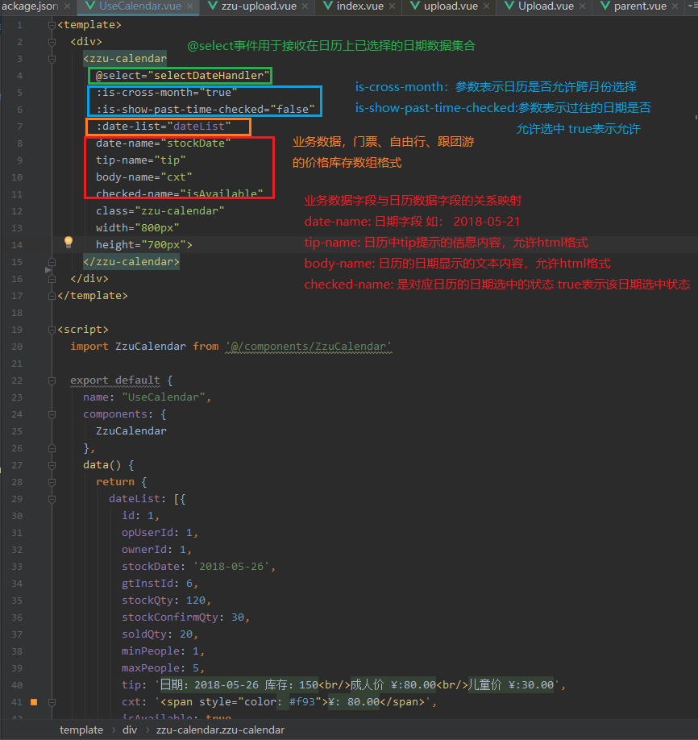

# trip-admin

> 星玥国际旅行运营管理系统
## 前端选型
- 编程语言JavaScript
- [ES6](http://www.ecma-international.org/ecma-262/6.0/)
- [Vue.js](https://cn.vuejs.org/index.html)
- [Vue Router](https://router.vuejs.org/zh-cn/)
- [Vuex](https://vuex.vuejs.org/zh-cn/)
- [axios Ajax库](https://github.com/axios/axios)
- [Element UI组件](http://element.eleme.io/#/zh-CN)
- [Echarts](http://echarts.baidu.com/)

## 开发工具
- [Git](https://git-scm.com/downloads)
- [Node.js 8.0+](https://nodejs.org/en/)
- [JetBrains Intelli IDEA](https://www.jetbrains.com/idea/)

## IDEA 安装插件
- Vue.js
- ESLint

## Build Setup

``` bash
# install dependencies
yarn 或 npm install

# serve with hot reload at localhost:8088
npm run dev

test

# build for production with minification
npm run build

# build for production and view the bundle analyzer report
npm run build --report

# run unit tests
npm run unit

# run all tests
npm test
```

For a detailed explanation on how things work, check out the [guide](http://vuejs-templates.github.io/webpack/) and [docs for vue-loader](http://vuejs.github.io/vue-loader).

## src 开发文件目录说明

	### assets 静态资源文件

		css 样式表

		fonts 图标字体

		img 图片

	### commons 公共方法和字典

		wordBook 字典

		functions 公共方法

	### components 组件

	### datas 假数据

	### filter 过滤器

	### views 具体页面

	### router 路由

	### services 数据服务

	### store 状态管理

## 日历组件的使用
```
- import ZzuCalendar from '@/components/ZzuCalendar'
- 注册@select事件监听函数，接收 dateList参数，该参数均为日历中处于选中状态的日期集合
- 日历的可选参数配置
- 业务数据与日历数据关系映射配置
```
[请参考Demo http://localhost:8088/#/use-calendar](http://localhost:8088/#/use-calendar)

## Demo路径：src/views/test/UseCalendar.vue



